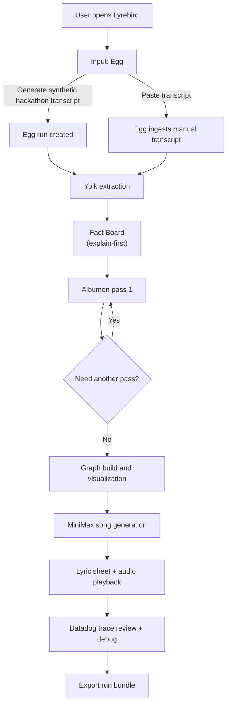
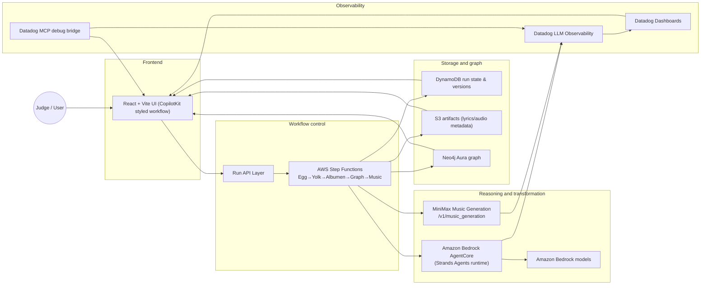

# Lyrebird — Log-to-Song Pipeline for Explainable GenAI Workflows

Lyrebird is a production-oriented Generative AI application built for the AWS x Datadog hackathon. It transforms team chat logs into a factual, auditable artifact: extract → review → sanitize → graph → music.

## One-line summary

Lyrebird converts raw conversation transcripts into verified factual statements, applies human-guided find/replace validation, persists lineage in a knowledge graph, and outputs a playable lyric-driven music artifact.

## Hackathon fit

Lyrebird satisfies the event’s core constraints:

- AWS infrastructure stack with Bedrock, Strands Agents, and Amazon Bedrock AgentCore Runtime
- Datadog observability integration with traces, dashboards, and runtime quality signals
- Live, production-shaped end-to-end demo with replayable pipeline stages
- Sponsor track implementation for MiniMax, Neo4j, TestSprite, and CopilotKit

## User flow

### High-level flow



### What this means for judges

1. Users start in **Egg** to produce a run context from either generated or pasted conversation.
2. **Yolk** extracts candidate facts with provenance and confidence.
3. A transparent **Facts Board** forces an explanation-first review (why each fact exists, not just what it says).
4. **Albumen** applies configurable pass rules (PII redaction, replacements, tone rewriting) and tracks per-pass diffs.
5. The system writes run artifacts into a **knowledge graph** so every transformation is traceable.
6. **Song generation** creates a factual lyric sheet and playable audio output from approved facts.
7. A **debug lane** surfaces run traces, latency, and quality signals, then exports full run state for review.

## System architecture



### Architecture notes

- **Frontend**: single-stage Copilot-like interface with stage timeline, fact review, albumen passes, graph visualization, and song playback.
- **Orchestrator**: AWS Step Functions provides deterministic stage transitions, retries, and deterministic run versioning.
- **Agent layer**: Strands Agents on Bedrock AgentCore handles fact extraction and structured fact workflows.
- **Persistent state**: run metadata and lifecycle status in DynamoDB, generated artifacts in S3, and graph lineage in Neo4j.
- **Music service**: MiniMax API generates instrumentals from selected lyric context.
- **Observability**: Datadog captures trace spans for every stage plus latency/error/quality signals and exposes a user-facing debug surface.
- **Quality control**: stage-level telemetry is continuously available and exportable for judging.

## Sponsor usage in final solution

### MiniMax

MiniMax powers the **Song** stage:

- Converts approved factual content into a music artifact through `POST /v1/music_generation`
- Uses configurable prompt and tone inputs
- Returns playable audio as run output with associated metadata

- Required request shape (from `api.minimax.io`):
  - `POST /v1/music_generation`
  - Headers: `Authorization: Bearer <MINIMAX_API_KEY>`, `Content-Type: application/json`
  - Body:
    - `model` (required): `"music-2.5"`
    - `prompt` (optional for music-2.5): style / mood description
    - `lyrics` (required): structured lyric text with tags like `[Intro]`, `[Verse]`, `[Chorus]`, `[Outro]`
    - `output_format` (optional): `"url"` or `"hex"` (default `"hex"`)
    - `audio_setting`: `{ sample_rate, bitrate, format: "mp3" }`

- This repo uses two-step generation in the mock backend:
  1. optional `POST /v1/lyrics_generation` (`mode: "write_full_song"`) to draft lyrics when a user asks for MiniMax.
  2. `POST /v1/music_generation` to produce the final playback artifact.

- Configure locally with:
  - `MINIMAX_API_KEY` or `MINMAX_API_KEY`
  - `MINIMAX_API_HOST` (defaults to `https://api.minimax.io`)
  - `MINIMAX_MOCK_ONLY=true` to force local deterministic tone fallback

### Neo4j

Neo4j stores run provenance as a graph:

- Message → Fact → Albumen pass → Song relationships
- Enables auditability of why each fact exists and how each transform changed it
- Powers graph explorer and debugging context in UI

### TestSprite

TestSprite is used for productized QA:

- E2E coverage of Egg → Yolk → Albumen → Graph → Song
- API-level regression testing for run lifecycle endpoints
- Failure-path coverage and test result reporting for confidence before judging

### CopilotKit

CopilotKit patterns shape the entire user-facing experience:

- Stage-based interactive controls and streaming action-oriented interface
- Fact review and transform controls as structured UI components
- Clear human-in-the-loop feedback loops over extracted and transformed content

## Run locally

```bash
npm install
cp .env.example .env
npm run dev
```

Then open:

```text
http://localhost:5173
```

## API endpoints

- `POST /api/run/egg`
- `POST /api/run/:runId/yolk`
- `POST /api/run/:runId/albumen`
- `POST /api/run/:runId/graph`
- `POST /api/run/:runId/music`
- `GET /api/run/:runId/debug`
- `GET /api/run/:runId/export`

## Scripts

- `npm run dev` — run local API + frontend
- `npm run dev:server` — run API service
- `npm run dev:client` — run frontend only
- `npm run build` — production build
- `npm run preview` — serve build output

## Project artifacts

- `src/App.tsx` – client workflow implementation and stage-driven screens
- `src/server/` – run orchestration API implementation
- `src/services/api.ts` — typed run APIs
- `src/types.ts` — typed run state, facts, passes, graph, and telemetry schemas
- `prd.md` — full problem framing, requirements, acceptance criteria

## Why judges should review Lyrebird

Lyrebird delivers an end-to-end, traceable, explainable pipeline that demonstrates both **LLM engineering maturity** and **system production qualities**: auditable extraction, explicit human control, graph lineage, structured retries, and telemetry-driven debugging.

## TestSprite Dashboard Setup (Why “No Test Created” appears)

If the dashboard shows `No Test Created`, there are no generated test cases for this repo yet.

Use this exact flow after `npm run testsprite:mcp` is running:

1. `testsprite_bootstrap`
   - `projectPath`: `/home/kirill/hachathons/lyrebird-awsloft-hack260220`
   - `type`: `"frontend"`
   - `testScope`: `"codebase"`
   - `localPort`: `5173`

2. `testsprite_generate_code_summary`
3. `testsprite_generate_standardized_prd`
4. `testsprite_generate_frontend_test_plan`
5. `testsprite_generate_code_and_execute`

Then open:

```text
https://www.testsprite.com/dashboard
```

After step 5 completes, run:

- `testsprite_open_test_result_dashboard`

and refresh the dashboard list. Tests should now appear in `Recent Created Tests`.
