# Lyrebird — Log-to-Song Pipeline for Explainable GenAI Workflows

Lyrebird is a production-oriented Generative AI application built for the AWS x Datadog hackathon. It transforms team chat logs into a factual, auditable artifact: extract → review → sanitize → graph → music.

## One-line summary

Lyrebird converts raw conversation transcripts into verified factual statements, applies human-guided find/replace validation, persists lineage in a knowledge graph, and outputs a playable lyric-driven music artifact.

## Hackathon fit

Lyrebird satisfies the event’s core constraints:

- AWS infrastructure stack with Bedrock, Strands Agents, and Amazon Bedrock AgentCore Runtime
- Datadog observability integration with traces, dashboards, and runtime quality signals
- Live, production-shaped end-to-end demo with replayable pipeline stages
- Sponsor track implementation for MiniMax, Neo4j, TestSprite, and CopilotKit

## User flow

### High-level flow

```mermaid
flowchart TD
  C[📄 Context]
  P[👤 Profile]

  subgraph Egg["🥚 Egg"]
    Y[🧬 Facts extraction]
    A[🍳 Semantic batch find and replace]
    R{🔁 again}
    F["✅ Final facts"]
  end

  C --> Y
  P --> Y
  Y --> A
  A --> R
  R -->|✅ Yes| A
  R -->|❌ No| F
  F --> G[🕸️ Graph]
  G --> M[🎧 MiniMax song generation]
```



### What this means for judges

1. Users start in **Egg** to produce a run context from either generated or pasted conversation.
2. **Context** and **Profile** feed into **Yolk**, which extracts candidate facts with provenance and confidence.
3. **Albumen** applies configurable pass rules to sanitized facts.
4. **Need another pass?** controls iteration until the team accepts **Final facts**.
5. **Graph** renders final fact lineage and then flows into **Music** generation from the approved artifact.

## System architecture

```mermaid
flowchart LR
  subgraph Client["Frontend"]
    FE["🧩 React + Vite UI (CopilotKit styled workflow)"] 
  end

  subgraph Orchestration["Workflow control"]
    SFn["⚙️ AWS Step Functions<br/>Egg→Yolk→Albumen→Graph→Music"]
    API["🌐 Run API Layer"]
  end

  subgraph Agents["Reasoning and transformation"]
    AgentCore["🧠 Amazon Bedrock AgentCore<br/>(Strands Agents runtime)"]
    Bedrock["🧮 Amazon Bedrock models"]
    MiniMax["🎼 MiniMax Music Generation<br/>/v1/music_generation"]
  end

  subgraph Data["Storage and graph"]
    DDB["🗂️ DynamoDB run state & versions"]
    S3["🗄️ S3 artifacts (lyrics/audio metadata)"]
    Neo4j["🕸️ Neo4j Aura graph"]
  end

  subgraph Ops["Observability"]
    DDTrace["📊 Datadog LLM Observability"]
    DDDash["📈 Datadog Dashboards"]
    DDmcp["🛠️ Datadog MCP debug bridge"]
  end

  User((👩‍⚖️ Judge / 👤 User)) --> FE
  FE --> API
  API --> SFn
  SFn --> AgentCore --> Bedrock
  SFn --> Neo4j
  SFn --> MiniMax
  SFn --> DDB
  SFn --> S3
  AgentCore --> DDTrace
  MiniMax --> DDTrace
  DDB --> FE
  S3 --> FE
  Neo4j --> FE
  DDTrace --> DDDash
  DDmcp --> DDTrace
  DDDash --> FE
  DDmcp --> FE
```



### Architecture notes

- **Frontend**: single-stage Copilot-like interface with stage timeline, fact review, albumen passes, graph visualization, and song playback.
- **Orchestrator**: AWS Step Functions provides deterministic stage transitions, retries, and deterministic run versioning.
- **Agent layer**: Strands Agents on Bedrock AgentCore handles fact extraction and structured fact workflows.
- **Persistent state**: run metadata and lifecycle status in DynamoDB, generated artifacts in S3, and graph lineage in Neo4j.
- **Music service**: MiniMax API generates instrumentals from selected lyric context.
- **Observability**: Datadog captures trace spans for every stage plus latency/error/quality signals and exposes a user-facing debug surface.
- **Quality control**: stage-level telemetry is continuously available and exportable for judging.

## Sponsor usage in final solution

### MiniMax

MiniMax powers the **Song** stage:

- Converts approved factual content into a music artifact through `POST /v1/music_generation`
- Uses configurable prompt and tone inputs
- Returns playable audio as run output with associated metadata

- Required request shape (from `api.minimax.io`):
  - `POST /v1/music_generation`
  - Headers: `Authorization: Bearer <MINIMAX_API_KEY>`, `Content-Type: application/json`
  - Body:
    - `model` (required): `"music-2.5"`
    - `prompt` (optional for music-2.5): style / mood description
    - `lyrics` (required): structured lyric text with tags like `[Intro]`, `[Verse]`, `[Chorus]`, `[Outro]`
    - `output_format` (optional): `"url"` or `"hex"` (default `"hex"`)
    - `audio_setting`: `{ sample_rate, bitrate, format: "mp3" }`

- This repo uses two-step generation in the mock backend:
  1. optional `POST /v1/lyrics_generation` (`mode: "write_full_song"`) to draft lyrics when a user asks for MiniMax.
  2. `POST /v1/music_generation` to produce the final playback artifact.

- Live demo artifact from the hackathon facts pipeline (pop + lyrics):
  - Generated track: [https://minimax-algeng-chat-tts-us.oss-us-east-1.aliyuncs.com/music%2Fprod%2Ftts-20260221103606-udrEprgbjcAeqNKa.mp3?Expires=1771727774&OSSAccessKeyId=LTAI5tCpJNKCf5EkQHSuL9xg&Signature=lnFzk%2BGZfr1u9vHthnM7Pj%2Ba4b8%3D](https://minimax-algeng-chat-tts-us.oss-us-east-1.aliyuncs.com/music%2Fprod%2Ftts-20260221103606-udrEprgbjcAeqNKa.mp3?Expires=1771727774&OSSAccessKeyId=LTAI5tCpJNKCf5EkQHSuL9xg&Signature=lnFzk%2BGZfr1u9vHthnM7Pj%2Ba4b8%3D)
  - Generated from `plans/minimax-pop-song-with-lyrics-request.json` and saved in `plans/minimax-pop-song-with-lyrics-response.json`.
  - Artifact JSON with lyrics for reuse: `plans/minimax-pop-song-with-lyrics-export.json`.
  - This uses explicit `lyrics` content for vocal melody.
  - Expires: `2026-02-22T02:36:14Z` (OSS pre-signed URL, replaceable on rerun).
  - Local offline file stored for GitHub: `plans/artifacts/minimax-pop-song-with-lyrics.mp3`.

- Configure locally with:
  - `MINIMAX_API_KEY` or `MINMAX_API_KEY`
  - `MINIMAX_API_HOST` (defaults to `https://api.minimax.io`)
  - `MINIMAX_MOCK_ONLY=true` to force local deterministic tone fallback

### Neo4j

Neo4j stores run provenance as a graph:

- Message → Fact → Albumen pass → Song relationships
- Enables auditability of why each fact exists and how each transform changed it
- Powers graph explorer and debugging context in UI

### TestSprite

TestSprite is used for productized QA:

- E2E coverage of Egg → Yolk → Albumen → Graph → Song
- API-level regression testing for run lifecycle endpoints
- Failure-path coverage and test result reporting for confidence before judging

### CopilotKit

CopilotKit patterns shape the entire user-facing experience:

- Stage-based interactive controls and streaming action-oriented interface
- Fact review and transform controls as structured UI components
- Clear human-in-the-loop feedback loops over extracted and transformed content

### Example Copilot assistant prompts

Use these prompts in the Copilot sidebar (`CopilotSidebar`) during demo:

- `What stage is the current run in, and did anything fail?`
- `Summarize the current facts and flag low-confidence or risky items.`
- `Which source messages support each approved fact?`
- `Did we run Albumen yet, and what changed in the last pass?`
- `Show me the graph lineage for the selected run and identify any disconnected nodes.`
- `Suggest a safe find/replace rule to de-identify names and emails.`
- `Why is music generation blocked right now, and what is the next action?`
- `Debug the current run: list blockers, latency, and likely fix path.`
- `Give me a judge-ready one-paragraph run summary.`
- `Compare this run with the previous version and list the deltas.`

Quick templates:

- `Help me debug run <RUN_ID>.`
- `Audit the last albumen pass: what changed and why.`
- `Prepare a short explanation for non-technical judges.`

## Placeholder inventory and integration notes

These are the active placeholder strings in the current code and how to integrate them:

- `src/App.tsx:648`
  - Placeholder text: `A CEO, engineer, or analyst persona can be used as context for fact extraction.`
  - Integration: this is a UI helper hint for profile context. Replace with a role-aware dynamic hint from config if you want different instructions per use case.

- `src/App.tsx:697`
  - Placeholder text: `find term`
  - Integration: this is the input hint for find pass terms. Keep for usability, or prefill from sponsor config so users can one-click fill sponsor entities.

- `src/App.tsx:721`
  - Placeholder text: `replace instruction`
  - Integration: replace hint for replace pass action. To integrate with product logic, map this to validation/normalization rules before calling `runReplace`.

- `src/App.tsx:686`
  - `className="placeholder-button"` controls on quick-fill chips (`🔍`, `✍️`).
  - Integration: currently seeds `sponsor` and `add 'amazing' to each sponsor name`; keep as seeded values or replace with a dynamic rule library.

- `plans/front-end-music-iteration-plan.md:42`
  - Placeholder phrase: `placeholder for future Discord connect`.
  - Integration: this documents a planned mode in `REQ-101`. Add a new Egg mode and route to your Discord ingestion API when that integration is implemented.

- Runtime behavior: there are no unresolved API key/URL placeholders in production-critical code beyond the `MINIMAX_API_KEY`/`MINMAX_API_KEY` env config path.

## Run locally

```bash
npm install
cp .env.example .env
npm run dev
```

Then open:

```text
http://localhost:5173
```

## API endpoints

- `POST /api/run/egg`
- `POST /api/run/:runId/yolk`
- `POST /api/run/:runId/albumen`
- `POST /api/run/:runId/graph`
- `POST /api/run/:runId/music`
- `GET /api/run/:runId/debug`
- `GET /api/run/:runId/export`

## Scripts

- `npm run dev` — run local API + frontend
- `npm run dev:server` — run API service
- `npm run dev:client` — run frontend only
- `npm run build` — production build
- `npm run preview` — serve build output

## Project artifacts

- `src/App.tsx` – client workflow implementation and stage-driven screens
- `src/server/` – run orchestration API implementation
- `src/services/api.ts` — typed run APIs
- `src/types.ts` — typed run state, facts, passes, graph, and telemetry schemas
- `prd.md` — full problem framing, requirements, acceptance criteria

## Why judges should review Lyrebird

Lyrebird delivers an end-to-end, traceable, explainable pipeline that demonstrates both **LLM engineering maturity** and **system production qualities**: auditable extraction, explicit human control, graph lineage, structured retries, and telemetry-driven debugging.

## TestSprite Dashboard Setup (Why “No Test Created” appears)

If the dashboard shows `No Test Created`, there are no generated test cases for this repo yet.

Use this exact flow after `npm run testsprite:mcp` is running:

1. `testsprite_bootstrap`
   - `projectPath`: `/home/kirill/hachathons/lyrebird-awsloft-hack260220`
   - `type`: `"frontend"`
   - `testScope`: `"codebase"`
   - `localPort`: `5173`

2. `testsprite_generate_code_summary`
3. `testsprite_generate_standardized_prd`
4. `testsprite_generate_frontend_test_plan`
5. `testsprite_generate_code_and_execute`

Then open:

```text
https://www.testsprite.com/dashboard
```

After step 5 completes, run:

- `testsprite_open_test_result_dashboard`

and refresh the dashboard list. Tests should now appear in `Recent Created Tests`.
