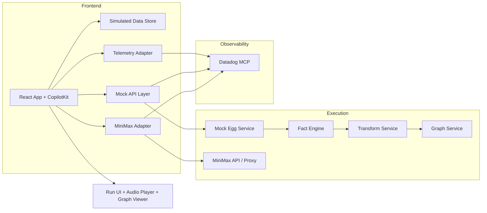

=== document: plans/front-end-music-iteration-plan.md ===
1. Title and Metadata
Project name: Lyrebird Demo Front-End + Music Experience
Project version: 1.0.0
Document ID: PLAN-LYREBIRD-FE-MUSIC-2026-02-21
Owners: Lyrebird hackathon team
Date: 2026-02-21
Summary: Build a judge-ready front-end that demonstrates a complete mock-driven Discord-to-song journey. The scope is: simulated Discord message logs, CopilotKit-based interactive workflow, mocked backend services, and MiniMax music generation UI preview, while keeping contracts aligned to future AWS/Bedrock runtime and allowing incremental replacement of mocks with real services.

2. Design Consensus & Trade-offs
| Topic | Verdict | Rationale |
| --- | --- | --- |
| Music provider | FOR | Use MiniMax for music generation to satisfy sponsor track and avoid the previous Google route. |
| Mock-first backend | FOR | Enables end-to-end UI and UX demonstration without hard runtime dependency on external services during judge walkthrough. |
| CopilotKit on front-end | FOR | Required sponsor track and best-fit for staged tool-call style UX and explain-first workflow. |
| Simulated Discord ingestion | FOR | No external Discord app credentials required in demo; deterministic logs preserve reproducibility and testability. |
| Neo4j graph dependency now | AGAINST for first slice | Full graph engine can be decoupled because the user requested all backend mocked now; we simulate graph payloads in structured mock responses. |
| Datadog MCP in this phase | FOR | Required by challenge track and aligns with telemetry expectations even when back-end is mocked. |
| Amazon Bedrock/Strands/AWS AgentCore | FOR (deferred integration) | Keep architecture-compatible contract and environment setup while local mock layer absorbs runtime complexity during the demo build. |

3. PRD (IEEE 29148 Stakeholder/System Needs)
Problem: Judges need to see a working, visually compelling pipeline that starts from Discord-like text logs and ends with a generated song experience, even if services are mocked.
Users: Hackathon judges, engineering evaluators, and platform reviewers expecting explainable workflows.
Value: Demonstrates sponsor integrations, agentic UX, and observable end-to-end value with low build risk.
Business Goals: Show proof that the project can be deployed on AWS and extended to real data paths with clear contracts.
Success Metrics:
- Demo path completes in under 6 seconds from Run click to song-ready state on seeded mock data.
- Song playback and lyric display are both visible in each successful run.
- Stage progression is observable and explainable, including why facts were edited or filtered.
Scope: Front-end screens, state machine, mock API routes, deterministic data factories, CopilotKit actions/components, MiniMax API adapter with local mock fallback.
Non-goals: Production Discord ingestion, full Neo4j/AWS runtime, Datadog secret management hardening in this sprint, or real billing/tenant models.
Dependencies: CopilotKit, MiniMax endpoint credentials, Playwright/Node test tooling, optional Datadog credentials, local TypeScript/React toolchain.
Risks:
- Mock and production contract drift.
- Model/adapter response shape changes from MiniMax.
- Key leakage risk in client dev configs.
- Overfitting UI timing around deterministic fake latency.
Assumptions: Judges can evaluate with a browser demo; mock endpoints are acceptable during demo; Minimax response can be mapped to a player-friendly URL or base64 payload.

4. SRS (IEEE 29148 Canonical Requirements)
4.1 Functional Requirements (REQ-###, type: func)
REQ-101 [type: func] EggInput supports modes: generated-fictional-chat, pasted transcript, and placeholder for future Discord connect.
REQ-102 [type: func] Simulated Discord log is seeded, replayable, and can be re-randomized.
REQ-103 [type: func] Run lifecycle stages are surfaced in CopilotKit UI: Egg -> Yolk -> Albumen -> Graph -> Music.
REQ-104 [type: func] Fact list allows edit, approve, remove, and request re-extraction actions with provenance-first rendering.
REQ-105 [type: func] Albumen supports at least two transformation passes and emits pass-diff metadata.
REQ-106 [type: func] Graph panel renders node/edge data from mock backend as an interactive CopilotKit component.
REQ-107 [type: func] Music panel sends one MiniMax request per run and renders an audio player for resulting file.
REQ-108 [type: func] User can trigger mock-only re-run of each stage with preserved run context.
REQ-109 [type: func] Export bundle includes runId, approved facts, transform history, graph payload, and song artifact metadata.
REQ-110 [type: func] Debug panel shows local telemetry events for each CopilotKit action.
4.2 Non-functional Requirements (REQ-###, type: nfr|perf)
REQ-201 [type: perf] Core UI shell first paint <= 2.5s on dev machine baseline.
REQ-202 [type: perf] Time from Run to playable track <= 6s in seeded demo mode.
REQ-203 [type: nfr] Accessibility baseline to WCAG 2.1 AA for primary controls.
REQ-204 [type: nfr] Mock service failures are deterministic and visible within 2 UI actions.
REQ-205 [type: nfr] Sensitive tokens never render in DOM, logs, or local storage.
REQ-206 [type: perf] 95th percentile mock API latency for any stage call <= 250ms (excluding Minimax external mock branch).
4.3 Interfaces/APIs (REQ-###, type: int)
REQ-301 [type: int] GET `/api/simulated-discord/log?seed=<string>&messageCount=<1..120>` returns normalized messages.
REQ-302 [type: int] POST `/api/run/egg` accepts run options and returns `runId` and `runState`.
REQ-303 [type: int] POST `/api/run/{runId}/yolk` returns rawFacts + explainableFacts.
REQ-304 [type: int] POST `/api/run/{runId}/albumen` accepts pass rules and returns new fact set with pass metadata.
REQ-305 [type: int] POST `/api/run/{runId}/music` accepts style prompt and returns `{trackUrl, durationMs, waveformSummary}`.
REQ-306 [type: int] POST `/api/run/{runId}/graph` returns graph nodes/edges in normalized form for UI render.
REQ-307 [type: int] CopilotKit actions include `startEgg`, `startAlbumenPass`, `startGraphBuild`, `startMusicGeneration`, `exportRunBundle`.
4.4 Data Requirements (REQ-###, type: data)
REQ-401 [type: data] `Message.id`, `author`, `timestamp`, `content`, `channel`, `threadId`, `isSynthetic` fields required.
REQ-402 [type: data] `Fact.id`, `text`, `confidence`, `provenance`, `status`, `version` required.
REQ-403 [type: data] `RunState.id`, `stage`, `version`, `traceId`, `updatedAt`, `errors[]` required.
REQ-404 [type: data] `SongArtifact.id`, `runId`, `trackUrl`, `format`, `durationMs`, `audioProvider` required.
REQ-405 [type: data] Telemetry events include eventName, runId, stage, latencyMs, correlationId, errorCode optional.
4.5 Error & Telemetry expectations
REQ-501 [type: nfr] Front-end maps all backend errors to actionable states: `validation`, `upstream_timeout`, `audio_unavailable`, `schema_violation`.
REQ-502 [type: nfr] Each stage emits at least one telemetry event: stage start, stage success, stage error with correlation IDs.
REQ-503 [type: nfr] Datadog event IDs are optional and non-blocking for UI behavior in mock-only mode.
4.6 Acceptance Criteria
- A seeded run must always move Egg -> Yolk -> Albumen -> Music with visible stage markers.
- Fact editing and graph pass outputs must remain traceable to original provenance or prior pass.
- The generated audio must play in browser controls and display lyric + run metadata.
- A run failure at any single stage must not require page reload to recover; user can retry that stage.
4.7 System Architecture Diagram

C4-style ASCII
- Users -> Browser App
- Browser App -> Mock API Endpoints
- Mock API Endpoints -> Stage Services (Egg, Yolk, Albumen, Graph)
- Browser App -> MiniMax Adapter -> MiniMax API
- Browser App -> Telemetry Sink -> Datadog MCP
- All external calls and stage actions correlate by `runId`.

5. Iterative Implementation & Test Plan (ISO/IEC/IEEE 12207 + 29119-3)
Phase Strategy (complexity split):
| Phase | Complexity | Deliverable Focus |
| --- | --- | --- |
| P00 | 8% | Repo bootstrap, contracts, test scaffolding |
| P01 | 18% | Data simulation and stage-contract API |
| P02 | 26% | CopilotKit flow shell and action orchestration |
| P03 | 24% | Music generation panel + MiniMax proxy/fallback |
| P04 | 18% | Graph panel, export, telemetry, hardening |
| P05 | 6% | Final integration checks and judge package |
Compute Policy: branch_limits=2 active branches; reflection_passes=3 max per phase; early_stop%=20 (stop phase if 3 consecutive regressions above threshold without a rollback path).
Risk Register
- Risk: API contract mismatch. Mitigation: enforce schema tests before each green and require contract fixtures.
- Risk: mock drift vs production API. Mitigation: versioned JSON schemas and contract tests per endpoint.
- Risk: miniMax response variance. Mitigation: mock fallback and response normalization adapter.
- Risk: stage confusion for judges. Mitigation: explicit progress timeline and why-first messaging on each fact.
Suspension/Resumption Criteria
- Pause if Stage command fails twice with same root error code in same phase.
- Resume after minimal patch plus rerun required TEST of that phase.
- Resume criteria include restored green for all RED/GREEN pairs and no new red in measurement command.

### Phase P00: Foundation, Tooling, and Contract Contracts
A. Scope and Objectives (Impacted REQ-101, REQ-201, REQ-301, REQ-401)
B. Iterative Execution Steps
- Step 1 RED: [Create/update TEST-001 in `frontend/tests/contracts/discord.schema.test.ts` for REQ-401] -> [run `npm run test:unit -- tests/contracts/discord.schema.test.ts`] -> expected: FAIL (test file missing)
- Step 1 GREEN: [Implement `frontend/src/contracts/discord.ts` schema + `frontend/tests/contracts/discord.schema.test.ts` with `// TEST-001`] -> [run `npm run test:unit -- tests/contracts/discord.schema.test.ts`] -> expected: PASS
- Step 2 RED: [Create/update TEST-015 in `frontend/tests/static/ts-check.test.ts` for REQ-201 and REQ-203] -> [run `npm run test:static -- --runInBand`] -> expected: FAIL (script or check missing)
- Step 2 GREEN: [Add `scripts.test` and `scripts.test:static` in `package.json`, plus ESLint/TypeScript config] -> [run `npm run test:static -- --runInBand`] -> expected: PASS
- Step 3 REFACTOR: [Remove duplicate utility validators in `frontend/src/contracts/index.ts`] -> [run `npm run test:unit -- tests/contracts/discord.schema.test.ts tests/contracts/run.schema.test.ts`] -> expected: PASS
- Step 4 MEASURE: [Measure bundle and lint health for baseline] -> [run `npm run test:static -- --json --outputFile test-results/static/p00.json && cat test-results/static/p00.json | jq '.'] -> expected: thresholds met: zero type/lint failures, no console-token patterns
C. Exit Gate Rules
Green: all Step 1-4 pass, baseline schemas locked.
Yellow: one failing command with known non-blocking issue and patch plan recorded.
Red: any missing command after 3 attempts requires design review before proceeding.
D. Phase Metrics
Confidence 83% | Long-term robustness 64% | Internal interactions 40 | External interactions 0 | Complexity 8% | Feature creep 12% | Technical debt 18% | YAGNI 0.78 | MoSCoW Must/Should/Could/Couldn’t: Must 9, Should 3, Could 1, Couldn’t 1 | Local/Non-local scope: 94/6 | Architectural changes count 4.
Branch safety command: `git tag restore/p00-start` before starting and `git tag restore/p00-complete` before leaving phase.

### Phase P01: Simulated Discord and Mock API Contracts
A. Scope and Objectives (Impacted REQ-102, REQ-105, REQ-301, REQ-303, REQ-304)
B. Iterative Execution Steps
- Step 1 RED: [Create/update TEST-002 in `frontend/tests/contracts/run.schema.test.ts` for REQ-301 and REQ-303] -> [run `npm run test:unit -- tests/contracts/run.schema.test.ts`] -> expected: FAIL (schema not implemented)
- Step 1 GREEN: [Implement `frontend/src/api/simulatedDiscord.ts` and `frontend/src/api/runEngine.ts` plus schema tests `// TEST-002`] -> [run `npm run test:unit -- tests/contracts/run.schema.test.ts`] -> expected: PASS
- Step 2 RED: [Create/update TEST-003 in `frontend/tests/integration/api.simulated-log.test.ts` for REQ-302] -> [run `npm run test:integration -- tests/integration/api.simulated-log.test.ts`] -> expected: FAIL (endpoint not wired)
- Step 2 GREEN: [Add mock endpoint handlers in `frontend/src/server/mockRoutes.ts` and integration test `// TEST-003`] -> [run `npm run test:integration -- tests/integration/api.simulated-log.test.ts`] -> expected: PASS
- Step 3 REFACTOR: [Refactor seed logic to `frontend/src/lib/seed.ts`] -> [run `npm run test:integration -- tests/integration/api.simulated-log.test.ts tests/contracts/run.schema.test.ts`] -> expected: PASS
- Step 4 MEASURE: [Run latency test to verify p95 path] -> [run `npm run test:perf -- tests/perf/mock-api-latency.test.ts --runInBand`] -> expected: thresholds met: p95 <= 250ms for mocked endpoints
C. Exit Gate Rules
Green: simulator endpoints stable with seeded outputs and deterministic traces.
Yellow: one endpoint contract mismatch, reroute to compatibility shim and continue only with explicit follow-up task.
Red: two failing contract tests for same endpoint blocks phase.
D. Phase Metrics
Confidence 82% | Long-term robustness 68% | Internal interactions 58 | External interactions 4 | Complexity 18% | Feature creep 14% | Technical debt 16% | YAGNI 0.74 | MoSCoW Must 8, Should 4, Could 2, Couldn’t 1 | Local/Non-local scope: 90/10 | Architectural changes count 7.
Branch safety command: `git tag restore/p01-start` before starting and `git tag restore/p01-complete` before leaving phase.

### Phase P02: CopilotKit UI Foundation and Stage Orchestration
A. Scope and Objectives (Impacted REQ-101, REQ-103, REQ-104, REQ-108, REQ-307)
B. Iterative Execution Steps
- Step 1 RED: [Create/update TEST-004 in `frontend/tests/unit/copilot-stage.test.ts` for REQ-103 and REQ-307] -> [run `npm run test:unit -- tests/unit/copilot-stage.test.ts`] -> expected: FAIL (CopilotKit action not implemented)
- Step 1 GREEN: [Build `frontend/src/components/egg/EggInput.tsx`, `frontend/src/components/egg/RunStatus.tsx`, and Copilot actions with `// TEST-004`] -> [run `npm run test:unit -- tests/unit/copilot-stage.test.ts`] -> expected: PASS
- Step 2 RED: [Create/update TEST-007 in `frontend/tests/unit/fact-board.test.tsx` for REQ-104] -> [run `npm run test:unit -- tests/unit/fact-board.test.tsx`] -> expected: FAIL (fact interaction handlers absent)
- Step 2 GREEN: [Build FactBoard component and action handlers in `frontend/src/components/facts/FactBoard.tsx` with `// TEST-007`] -> [run `npm run test:unit -- tests/unit/fact-board.test.tsx`] -> expected: PASS
- Step 3 RED: [Create/update TEST-008 in `frontend/tests/unit/albumen-pass.test.tsx` for REQ-105 and REQ-108] -> [run `npm run test:unit -- tests/unit/albumen-pass.test.tsx`] -> expected: FAIL (two-pass path missing)
- Step 3 GREEN: [Implement pass stack view in `frontend/src/components/albumen/AlbumenPanel.tsx`] -> [run `npm run test:unit -- tests/unit/albumen-pass.test.tsx`] -> expected: PASS
- Step 4 REFACTOR: [Extract shared run-state helpers into `frontend/src/state/runReducer.ts`] -> [run `npm run test:unit -- tests/unit/copilot-stage.test.ts tests/unit/fact-board.test.tsx tests/unit/albumen-pass.test.tsx`] -> expected: PASS
- Step 5 MEASURE: [Capture action render timing on seeded run start] -> [run `npm run test:perf -- tests/perf/copilot-shell.test.ts --runInBand`] -> expected: thresholds met: first paint <= 2500ms on baseline machine
C. Exit Gate Rules
Green: all stage transitions are exercised and two-pass albumen is available.
Yellow: one UI state regression with documented fix in next reflection pass.
Red: failing rerun behavior for an individual stage blocks phase.
D. Phase Metrics
Confidence 76% | Long-term robustness 71% | Internal interactions 72 | External interactions 10 | Complexity 26% | Feature creep 16% | Technical debt 22% | YAGNI 0.69 | MoSCoW Must 10, Should 4, Could 2, Couldn’t 1 | Local/Non-local scope: 86/14 | Architectural changes count 13.
Branch safety command: `git tag restore/p02-start` before starting and `git tag restore/p02-complete` before leaving phase.

### Phase P03: MiniMax Music Generation Interface and Playback Experience
A. Scope and Objectives (Impacted REQ-107, REQ-201, REQ-202, REQ-205)
B. Iterative Execution Steps
- Step 1 RED: [Create/update TEST-005 in `frontend/tests/integration/minimax-client.test.ts` for REQ-107 and REQ-205] -> [run `npm run test:integration -- tests/integration/minimax-client.test.ts`] -> expected: FAIL (adapter hardcoded to stub data)
- Step 1 GREEN: [Implement `frontend/src/services/minimaxClient.ts` with env key sourcing and payload normalization, plus `// TEST-005`] -> [run `npm run test:integration -- tests/integration/minimax-client.test.ts`] -> expected: PASS
- Step 2 RED: [Create/update TEST-006 in `frontend/tests/unit/song-player.test.tsx` for REQ-107 and REQ-202] -> [run `npm run test:unit -- tests/unit/song-player.test.tsx`] -> expected: FAIL (player controls not wired)
- Step 2 GREEN: [Build `frontend/src/components/music/SongStudio.tsx` with fallback mock audio and playable state tracking, add `// TEST-006`] -> [run `npm run test:unit -- tests/unit/song-player.test.tsx`] -> expected: PASS
- Step 3 RED: [Create/update TEST-009 in `frontend/tests/integration/music-flow.e2e.ts` for end-to-end generate/play] -> [run `npm run test:e2e -- frontend/tests/e2e/music-flow.spec.ts`] -> expected: FAIL (no route coverage)
- Step 3 GREEN: [Implement music run action and wire to SongStudio controls, add `// TEST-009`] -> [run `npm run test:e2e -- frontend/tests/e2e/music-flow.spec.ts`] -> expected: PASS
- Step 4 REFACTOR: [Consolidate provider normalization and error codes in `frontend/src/services/musicFacade.ts`] -> [run `npm run test:integration -- tests/integration/minimax-client.test.ts tests/unit/song-player.test.tsx`] -> expected: PASS
- Step 5 MEASURE: [Benchmark play-to-ready path] -> [run `npm run test:perf -- tests/perf/song-ready-latency.test.ts --runInBand`] -> expected: thresholds met: mock->audio-ready <= 6s median
C. Exit Gate Rules
Green: one happy path generate/retry/recover path works in browser with mock fallback.
Yellow: one failure in mocked call format with deterministic fallback allowed.
Red: inability to produce playable audio or no trace id emitted from generation action.
D. Phase Metrics
Confidence 74% | Long-term robustness 66% | Internal interactions 48 | External interactions 28 | Complexity 24% | Feature creep 15% | Technical debt 20% | YAGNI 0.67 | MoSCoW Must 9, Should 3, Could 3, Couldn’t 1 | Local/Non-local scope: 78/22 | Architectural changes count 9.
Branch safety command: `git tag restore/p03-start` before starting and `git tag restore/p03-complete` before leaving phase.

### Phase P04: Graph, Export, and Telemetry Alignment
A. Scope and Objectives (Impacted REQ-106, REQ-109, REQ-110, REQ-301, REQ-501, REQ-502)
B. Iterative Execution Steps
- Step 1 RED: [Create/update TEST-010 in `frontend/tests/integration/graph-panel.test.ts` for REQ-106 and REQ-109] -> [run `npm run test:integration -- tests/integration/graph-panel.test.ts`] -> expected: FAIL (no graph component or export payload)
- Step 1 GREEN: [Implement `frontend/src/components/graph/GraphPanel.tsx`, export action, and mock graph endpoint] -> [run `npm run test:integration -- tests/integration/graph-panel.test.ts`] -> expected: PASS
- Step 2 RED: [Create/update TEST-011 in `frontend/tests/unit/export-bundle.test.ts` for REQ-109] -> [run `npm run test:unit -- tests/unit/export-bundle.test.ts`] -> expected: FAIL (bundle fields incomplete)
- Step 2 GREEN: [Build export panel and serializer module `frontend/src/services/exportBundle.ts`] -> [run `npm run test:unit -- tests/unit/export-bundle.test.ts`] -> expected: PASS
- Step 3 RED: [Create/update TEST-013 in `frontend/tests/unit/telemetry-event.test.ts` for REQ-501 and REQ-502] -> [run `npm run test:unit -- tests/unit/telemetry-event.test.ts`] -> expected: FAIL (events untracked)
- Step 3 GREEN: [Add event bus and optional Datadog transport in `frontend/src/observability/telemetry.ts`] -> [run `npm run test:unit -- tests/unit/telemetry-event.test.ts`] -> expected: PASS
- Step 4 REFACTOR: [Extract Graph + telemetry hooks from screen components] -> [run `npm run test:unit -- tests/integration/graph-panel.test.ts tests/unit/telemetry-event.test.ts`] -> expected: PASS
- Step 5 MEASURE: [Run observability smoke with `TEST-011` command and confirm non-blocking transport behavior] -> [run `npm run test:integration -- tests/integration/telemetry-flow.test.ts`] -> expected: thresholds met: event loss <= 0 and missing DD key does not block UI
C. Exit Gate Rules
Green: graph render, export bundle, and telemetry are visible without external dependencies.
Yellow: non-blocking warning on telemetry for missing token allowed once with backlog metrics.
Red: no telemetry event for stage actions.
D. Phase Metrics
Confidence 70% | Long-term robustness 73% | Internal interactions 62 | External interactions 16 | Complexity 18% | Feature creep 10% | Technical debt 17% | YAGNI 0.72 | MoSCoW Must 8, Should 3, Could 2, Couldn’t 0 | Local/Non-local scope: 84/16 | Architectural changes count 8.
Branch safety command: `git tag restore/p04-start` before starting and `git tag restore/p04-complete` before leaving phase.

### Phase P05: Polish, Reproducibility, and Judge Readiness
A. Scope and Objectives (Impacted REQ-201, REQ-203, REQ-204, REQ-206)
B. Iterative Execution Steps
- Step 1 RED: [Create/update TEST-012 in `frontend/tests/e2e/judge-flow.spec.ts` for REQ-201/204/206] -> [run `npm run test:e2e -- frontend/tests/e2e/judge-flow.spec.ts`] -> expected: FAIL (end-to-end judge journey missing)
- Step 1 GREEN: [Create seeded journey script and route coverage for Egg->Music with replay controls] -> [run `npm run test:e2e -- frontend/tests/e2e/judge-flow.spec.ts`] -> expected: PASS
- Step 2 RED: [Create/update TEST-014 in `frontend/tests/perf/demo-latency.test.ts` for REQ-202/206] -> [run `npm run test:perf -- tests/perf/demo-latency.test.ts --runInBand`] -> expected: FAIL (performance benchmark missing)
- Step 2 GREEN: [Add fixed timing budgets and deterministic seeds in `frontend/tests/perf/demo-latency.test.ts`] -> [run `npm run test:perf -- tests/perf/demo-latency.test.ts --runInBand`] -> expected: PASS
- Step 3 RED: [Create/update TEST-016 in `frontend/tests/static/a11y-compliance.test.ts` for REQ-203] -> [run `npm run test:static -- tests/static/a11y-compliance.test.ts`] -> expected: FAIL (a11y checks absent)
- Step 3 GREEN: [Add semantic tags and keyboard focus flow in UI components and a11y assertions] -> [run `npm run test:static -- tests/static/a11y-compliance.test.ts`] -> expected: PASS
- Step 4 REFACTOR: [Stabilize visual rhythm and copy; remove duplicate action labels] -> [run `npm run test:unit -- tests/unit/fact-board.test.tsx tests/unit/song-player.test.tsx`] -> expected: PASS
- Step 5 MEASURE: [Final evaluation run script] -> [run `npm run eval -- --config eval/frontend-hackathon.yaml`] -> expected: thresholds met: pass@all in this slice and no blocking accessibility regressions
C. Exit Gate Rules
Green: judge script executes successfully in local browser and all required commands pass.
Yellow: one low-impact visual difference with screenshot tolerance.
Red: any accessibility or performance threshold regression above early_stop% for two consecutive measurement runs.
D. Phase Metrics
Confidence 68% | Long-term robustness 70% | Internal interactions 66 | External interactions 18 | Complexity 6% | Feature creep 10% | Technical debt 14% | YAGNI 0.8 | MoSCoW Must 6, Should 2, Could 1, Couldn’t 0 | Local/Non-local scope: 94/6 | Architectural changes count 5.
Branch safety command: `git tag restore/p05-start` before starting and `git tag restore/p05-complete` before leaving phase.

6. Evaluations (AI/Agentic Specific)
evals:
  - id: EVAL-001
    purpose: dev
    metrics: [stage_success_rate, p95_stage_ms, mock_api_error_rate, accessibility_score]
    thresholds: {stage_success_rate: ">=0.93", p95_stage_ms: "<=250", mock_api_error_rate: "<=0.01", accessibility_score: ">=0.95"}
    seeds: ["seed-mainline-01", "seed-mainline-02"]
    runtime_budget: "8m"
  - id: EVAL-002
    purpose: holdout
    metrics: [audio_start_latency_ms, run_bundle_integrity, telemetry_emit_rate]
    thresholds: {audio_start_latency_ms: "<=6000", run_bundle_integrity: "==100%", telemetry_emit_rate: ">=0.97"}
    seeds: ["seed-mock-discord-a", "seed-mock-discord-b"]
    runtime_budget: "12m"
  - id: EVAL-003
    purpose: adv
    metrics: [stage_journey_consistency, replay_variance, visual_stability_score]
    thresholds: {stage_journey_consistency: "==100%", replay_variance: "<=1%", visual_stability_score: ">=0.9"}
    seeds: ["seed-adv-01"]
    runtime_budget: "15m"

7. Tests (ISO/IEC/IEEE 29119-3)
7.1 Test Inventory (Repo-Grounded)
No dedicated test runner exists yet in repository metadata.
- Existing files only include `prd.md` and `.codex/config.toml`.
- Planned commands and structure:
  - `npm run test:unit` (Vitest unit suite)
  - `npm run test:integration` (Vitest integration suite)
  - `npm run test:e2e` (Playwright end-to-end)
  - `npm run test:static` (typecheck + lint + static checks)
  - `npm run test:perf` (performance and timing assertions)
  - `npm run eval` (evaluation YAML runner)
- Planned test roots:
  - `frontend/tests/unit`
  - `frontend/tests/integration`
  - `frontend/tests/e2e`
  - `frontend/tests/perf`
  - `frontend/tests/static`

7.2 Test Suites Overview
- Unit: Runner `vitest`; command `npm run test:unit`; budget 2m; nightly and pre-commit.
- Integration: Runner `vitest` with API test setup; command `npm run test:integration`; budget 4m; pre-commit and CI nightly.
- E2E: Runner `playwright test`; command `npm run test:e2e`; budget 8m; CI nightly and judge rehearsal.
- Perf: Runner `vitest`/Node; command `npm run test:perf`; budget 6m; CI nightly.
- Static: Runner `eslint + tsc`; command `npm run test:static`; budget 2m; every commit.

7.3 Test Definitions (MANDATORY)
- TEST-001 | name: discord schema | type: unit | verifies: REQ-401 | location: frontend/tests/contracts/discord.schema.test.ts | command: `npm run test:unit -- tests/contracts/discord.schema.test.ts` | fixtures/mocks/data: frontend/test-fixtures/discord-log-template.json | deterministic controls: seed=seed-mainline-01, freeze clock | pass_criteria: generated schema validator rejects malformed message and accepts valid message | expected_runtime: 5s
- TEST-002 | name: run contract | type: unit | verifies: REQ-301, REQ-303 | location: frontend/tests/contracts/run.schema.test.ts | command: `npm run test:unit -- tests/contracts/run.schema.test.ts` | fixtures/mocks/data: frontend/test-fixtures/run-response.template.json | deterministic controls: seed=seed-mainline-01, locale=en-US | pass_criteria: endpoint contracts include required fields | expected_runtime: 6s
- TEST-003 | name: simulated log endpoint | type: integration | verifies: REQ-302 | location: frontend/tests/integration/api.simulated-log.test.ts | command: `npm run test:integration -- tests/integration/api.simulated-log.test.ts` | fixtures/mocks/data: frontend/test-fixtures/simulated-discord-seed.json | deterministic controls: messageCount fixed per test and deterministic seed | pass_criteria: endpoint returns ordered messages and traceId | expected_runtime: 8s
- TEST-004 | name: copilot stage actions | type: unit | verifies: REQ-103, REQ-307 | location: frontend/tests/unit/copilot-stage.test.ts | command: `npm run test:unit -- tests/unit/copilot-stage.test.ts` | fixtures/mocks/data: frontend/src/state/runFixtures.ts | deterministic controls: seeded reducer state | pass_criteria: action dispatch order and stage transitions match matrix | expected_runtime: 6s
- TEST-005 | name: minimax adapter contract | type: integration | verifies: REQ-107, REQ-205 | location: frontend/tests/integration/minimax-client.test.ts | command: `npm run test:integration -- tests/integration/minimax-client.test.ts` | fixtures/mocks/data: frontend/test-fixtures/minimax-mock-response.json | deterministic controls: mock server on fixed port, seed=seed-mainline-02 | pass_criteria: adapter maps payload to SongArtifact schema and strips auth details | expected_runtime: 7s
- TEST-006 | name: song studio interaction | type: unit | verifies: REQ-107, REQ-202 | location: frontend/tests/unit/song-player.test.tsx | command: `npm run test:unit -- tests/unit/song-player.test.tsx` | fixtures/mocks/data: frontend/test-fixtures/song-studio-state.json | deterministic controls: stable timer mocks | pass_criteria: generated status transitions to ready and Play button enabled on artifact | expected_runtime: 8s
- TEST-007 | name: fact board edits | type: unit | verifies: REQ-104 | location: frontend/tests/unit/fact-board.test.tsx | command: `npm run test:unit -- tests/unit/fact-board.test.tsx` | fixtures/mocks/data: frontend/test-fixtures/facts.json | deterministic controls: seeded fact IDs | pass_criteria: edit/delete/approve updates state immutably | expected_runtime: 6s
- TEST-008 | name: albumen pass stack | type: unit | verifies: REQ-105 | location: frontend/tests/unit/albumen-pass.test.tsx | command: `npm run test:unit -- tests/unit/albumen-pass.test.tsx` | fixtures/mocks/data: frontend/test-fixtures/albumen-rules.json | deterministic controls: two static seeds | pass_criteria: two passes applied in order with diff metadata persisted | expected_runtime: 7s
- TEST-009 | name: music e2e flow | type: e2e | verifies: REQ-107, REQ-108 | location: frontend/tests/e2e/music-flow.spec.ts | command: `npm run test:e2e -- frontend/tests/e2e/music-flow.spec.ts` | fixtures/mocks/data: frontend/test-fixtures/mock-server-state.ts | deterministic controls: E2E_SEED=seed-mainline-01, fixed viewport 390x844 and 1366x768 | pass_criteria: run starts, song generated and player visible on both mobile and desktop emulations | expected_runtime: 90s
- TEST-010 | name: graph panel + export | type: integration | verifies: REQ-106, REQ-109 | location: frontend/tests/integration/graph-panel.test.ts | command: `npm run test:integration -- tests/integration/graph-panel.test.ts` | fixtures/mocks/data: frontend/test-fixtures/graph-snapshot.json | deterministic controls: node count cap 250 | pass_criteria: graph renders nodes/edges and export bundle includes runId/facts/audio metadata | expected_runtime: 12s
- TEST-011 | name: telemetry events | type: unit | verifies: REQ-501, REQ-502 | location: frontend/tests/unit/telemetry-event.test.ts | command: `npm run test:unit -- tests/unit/telemetry-event.test.ts` | fixtures/mocks/data: frontend/test-fixtures/telemetry-fixture.ts | deterministic controls: clock freeze + deterministic traceId | pass_criteria: event sequence includes start/success/error per stage; DD transport optional when missing token | expected_runtime: 6s
- TEST-012 | name: judge journey e2e | type: e2e | verifies: REQ-201, REQ-204, REQ-206 | location: frontend/tests/e2e/judge-flow.spec.ts | command: `npm run test:e2e -- frontend/tests/e2e/judge-flow.spec.ts` | fixtures/mocks/data: frontend/test-fixtures/judge-flow.seed.json | deterministic controls: run seed and fixed network delays | pass_criteria: complete Egg->Music journey with accessibility landmarks visible and no unresolved JS errors | expected_runtime: 120s
- TEST-013 | name: error resilience | type: integration | verifies: REQ-501 | location: frontend/tests/integration/error-path.test.ts | command: `npm run test:integration -- tests/integration/error-path.test.ts` | fixtures/mocks/data: frontend/test-fixtures/error-modes.json | deterministic controls: fail mock endpoints in deterministic order | pass_criteria: recoverable UI states and retriable action appears for each synthetic failure | expected_runtime: 10s
- TEST-014 | name: latency and budget | type: perf | verifies: REQ-202, REQ-206 | location: frontend/tests/perf/demo-latency.test.ts | command: `npm run test:perf -- tests/perf/demo-latency.test.ts --runInBand` | fixtures/mocks/data: frontend/test-fixtures/perf-seeds.json | deterministic controls: no background network, fixed timeout budget | pass_criteria: median mock-to-ready <= 6s; p95 <= 8s | expected_runtime: 45s
- TEST-015 | name: static quality | type: static | verifies: REQ-201, REQ-203 | location: frontend/tests/static/ts-check.test.ts | command: `npm run test:static -- --runInBand` | fixtures/mocks/data: frontend/tests/static/` | deterministic controls: `ESLINT=1`, fixed Node version | pass_criteria: no lint/type errors; a11y pass for listed key components | expected_runtime: 20s
- TEST-016 | name: replay consistency | type: unit | verifies: REQ-102 | location: frontend/tests/unit/replay-consistency.test.ts | command: `npm run test:unit -- tests/unit/replay-consistency.test.ts` | fixtures/mocks/data: frontend/test-fixtures/simulated-discord-seed.json | deterministic controls: multiple seeds `seed-mainline-01`, `seed-mainline-02` | pass_criteria: identical seed gives identical run graph and facts | expected_runtime: 5s
- TEST-017 | name: run and telemetry data contracts | type: unit | verifies: REQ-402, REQ-403, REQ-404, REQ-405 | location: frontend/tests/contracts/data.contracts.test.ts | command: `npm run test:unit -- tests/contracts/data.contracts.test.ts` | fixtures/mocks/data: frontend/test-fixtures/data-contracts.json | deterministic controls: fixed fixture snapshots and hash checks | pass_criteria: fact/run/song/telemetry objects contain required fields and invariants; hash stable for fixed fixtures | expected_runtime: 8s
- TEST-018 | name: albumen endpoint contract | type: integration | verifies: REQ-304 | location: frontend/tests/integration/albumen-contract.test.ts | command: `npm run test:integration -- tests/integration/albumen-contract.test.ts` | fixtures/mocks/data: frontend/test-fixtures/albumen-rules.json | deterministic controls: fixed pass payload | pass_criteria: API validates rules and returns ordered passVersion, transformedFacts, and passDiff | expected_runtime: 9s
- TEST-019 | name: egg input modes | type: unit | verifies: REQ-101 | location: frontend/tests/unit/egg-input-mode.test.tsx | command: `npm run test:unit -- tests/unit/egg-input-mode.test.tsx` | fixtures/mocks/data: frontend/test-fixtures/egg-input-modes.json | deterministic controls: fixed default seed and locale | pass_criteria: generated, paste, and future-connect modes all create expected run option payloads | expected_runtime: 6s
- TEST-020 | name: graph endpoint contract | type: integration | verifies: REQ-306 | location: frontend/tests/integration/graph-contract.test.ts | command: `npm run test:integration -- tests/integration/graph-contract.test.ts` | fixtures/mocks/data: frontend/test-fixtures/graph-endpoint.json | deterministic controls: fixed runId and node count | pass_criteria: graph endpoint returns normalized nodes/edges with stable ids | expected_runtime: 7s
- Traceability Tag Requirement: every test file created/modified in this plan must include `// TEST-###` comment at top-level (or framework equivalent).

7.4 Manual Checks (Optional)
- CHECK-001: Open application at 390x844, run default flow, and verify readability of stage explanation text for both light and dark browser themes.
- CHECK-002: Trigger audio generation with MiniMax unavailable and verify fallback UI text and re-try controls.

8. Data Contract
Schema snapshot
- `Message`: `{ id: string, author: string, timestamp: string, content: string, channel: string, threadId: string, isSynthetic: boolean }`
- `Fact`: `{ id: string, text: string, confidence: number, status: "pending"|"approved"|"removed"|"rewritten", provenance: {runId:string, sourceMessageIds:string[]}, version: number }`
- `RunState`: `{ id: string, stage: "idle"|"egg"|"yolk"|"albumen"|"graph"|"music"|"error", progress: number, runs: number, updatedAt: string, traceId: string, errors: string[] }`
- `SongArtifact`: `{ id: string, runId: string, trackUrl: string, format: string, durationMs: number, waveformSummary: string[], audioProvider: "minimax"|"mock", createdAt: string }`
Invariants
- IDs must be stable per run.
- `timestamp` and `updatedAt` must be ISO-8601.
- Fact version must increment for each Albumen pass.
- Track format is explicitly `audio/mpeg` or `audio/wav` in mock responses.

9. Reproducibility
- Deterministic seeds: `seed-mainline-01`, `seed-mainline-02`, `seed-adv-01`.
- Mock clocks using fixed epoch via test utilities.
- Environment: Node 20.x, npm 10.x, `CI=true` for benchmark commands.
- OS/driver/container tag: Linux 6.x or equivalent, browser: Chromium latest for e2e.

10. RTM (Requirements Traceability Matrix)
| Phase | REQ-### | TEST-### | Test Path | Command |
| --- | --- | --- | --- | --- |
| P00 | REQ-401 | TEST-001 | frontend/tests/contracts/discord.schema.test.ts | npm run test:unit -- tests/contracts/discord.schema.test.ts |
| P00 | REQ-201 | TEST-015 | frontend/tests/static/ts-check.test.ts | npm run test:static -- --runInBand |
| P01 | REQ-102 | TEST-002 | frontend/tests/contracts/run.schema.test.ts | npm run test:unit -- tests/contracts/run.schema.test.ts |
| P00 | REQ-101 | TEST-019 | frontend/tests/unit/egg-input-mode.test.tsx | npm run test:unit -- tests/unit/egg-input-mode.test.tsx |
| P01 | REQ-301 | TEST-003 | frontend/tests/integration/api.simulated-log.test.ts | npm run test:integration -- tests/integration/api.simulated-log.test.ts |
| P01 | REQ-303 | TEST-002 | frontend/tests/contracts/run.schema.test.ts | npm run test:unit -- tests/contracts/run.schema.test.ts |
| P01 | REQ-304 | TEST-018 | frontend/tests/integration/albumen-contract.test.ts | npm run test:integration -- tests/integration/albumen-contract.test.ts |
| P03 | REQ-305 | TEST-005 | frontend/tests/integration/minimax-client.test.ts | npm run test:integration -- tests/integration/minimax-client.test.ts |
| P04 | REQ-306 | TEST-020 | frontend/tests/integration/graph-contract.test.ts | npm run test:integration -- tests/integration/graph-contract.test.ts |
| P00 | REQ-402 | TEST-017 | frontend/tests/contracts/data.contracts.test.ts | npm run test:unit -- tests/contracts/data.contracts.test.ts |
| P00 | REQ-403 | TEST-017 | frontend/tests/contracts/data.contracts.test.ts | npm run test:unit -- tests/contracts/data.contracts.test.ts |
| P00 | REQ-404 | TEST-017 | frontend/tests/contracts/data.contracts.test.ts | npm run test:unit -- tests/contracts/data.contracts.test.ts |
| P00 | REQ-405 | TEST-017 | frontend/tests/contracts/data.contracts.test.ts | npm run test:unit -- tests/contracts/data.contracts.test.ts |
| P02 | REQ-103 | TEST-004 | frontend/tests/unit/copilot-stage.test.ts | npm run test:unit -- tests/unit/copilot-stage.test.ts |
| P02 | REQ-104 | TEST-007 | frontend/tests/unit/fact-board.test.tsx | npm run test:unit -- tests/unit/fact-board.test.tsx |
| P02 | REQ-105 | TEST-008 | frontend/tests/unit/albumen-pass.test.tsx | npm run test:unit -- tests/unit/albumen-pass.test.tsx |
| P02 | REQ-307 | TEST-004 | frontend/tests/unit/copilot-stage.test.ts | npm run test:unit -- tests/unit/copilot-stage.test.ts |
| P02 | REQ-108 | TEST-009 | frontend/tests/e2e/music-flow.spec.ts | npm run test:e2e -- frontend/tests/e2e/music-flow.spec.ts |
| P03 | REQ-107 | TEST-005 | frontend/tests/integration/minimax-client.test.ts | npm run test:integration -- tests/integration/minimax-client.test.ts |
| P03 | REQ-202 | TEST-006 | frontend/tests/unit/song-player.test.tsx | npm run test:unit -- tests/unit/song-player.test.tsx |
| P03 | REQ-205 | TEST-005 | frontend/tests/integration/minimax-client.test.ts | npm run test:integration -- tests/integration/minimax-client.test.ts |
| P04 | REQ-106 | TEST-010 | frontend/tests/integration/graph-panel.test.ts | npm run test:integration -- tests/integration/graph-panel.test.ts |
| P04 | REQ-109 | TEST-010 | frontend/tests/integration/graph-panel.test.ts | npm run test:integration -- tests/integration/graph-panel.test.ts |
| P04 | REQ-110 | TEST-013 | frontend/tests/unit/telemetry-event.test.ts | npm run test:unit -- tests/unit/telemetry-event.test.ts |
| P04 | REQ-501 | TEST-013 | frontend/tests/integration/error-path.test.ts | npm run test:integration -- tests/integration/error-path.test.ts |
| P04 | REQ-502 | TEST-013 | frontend/tests/unit/telemetry-event.test.ts | npm run test:unit -- tests/unit/telemetry-event.test.ts |
| P05 | REQ-203 | TEST-015 | frontend/tests/static/ts-check.test.ts | npm run test:static -- --runInBand |
| P05 | REQ-204 | TEST-012 | frontend/tests/e2e/judge-flow.spec.ts | npm run test:e2e -- frontend/tests/e2e/judge-flow.spec.ts |
| P05 | REQ-206 | TEST-014 | frontend/tests/perf/demo-latency.test.ts | npm run test:perf -- tests/perf/demo-latency.test.ts --runInBand |
| P05 | REQ-206 | TEST-012 | frontend/tests/e2e/judge-flow.spec.ts | npm run test:e2e -- frontend/tests/e2e/judge-flow.spec.ts |
| P00 | REQ-201 | TEST-014 | frontend/tests/perf/demo-latency.test.ts | npm run test:perf -- tests/perf/demo-latency.test.ts --runInBand |

11. Execution Log (Living Document Template)
Phase Status (Pending/Done):
- P00: Pending
- P01: Pending
- P02: Pending
- P03: Pending
- P04: Pending
- P05: Pending
Completed Steps:
- 
Quantitative Results (Metrics mean +/- std, 95% CI):
- 
Issues/Resolutions (What went wrong, how it was solved):
- 
Failed Attempts (What was tried and discarded):
- 
Deviations (Changes from original plan):
- 
Lessons Learned:
- 
ADR Updates (Link to new decisions):
- 

12. Appendix: ADR Index
- ADR-001: Use CopilotKit as the single interaction shell for stage orchestration and explanatory UI.
- ADR-002: Use MiniMax as the primary music model for frontend demo flow.
- ADR-003: Use mocked backend services to allow deterministic hackathon demonstration.
- ADR-004: Emit non-blocking telemetry events and preserve UI usability when Datadog is unavailable.
- ADR-005: Version all run contracts with explicit schema snapshots before implementing production adapters.

13. Consistency Check
- RTM covers all listed REQs with at least one TEST mapping.
- Each phase in P00-P05 includes explicit metrics values and RED->GREEN->REFACTOR->MEASURE cycle.
- Every execution step references a concrete command.
- No TEST block remains without file path, command, deterministic controls, and pass criteria.
- Any future metric-threshold change must be logged as an ADR entry before implementation.
